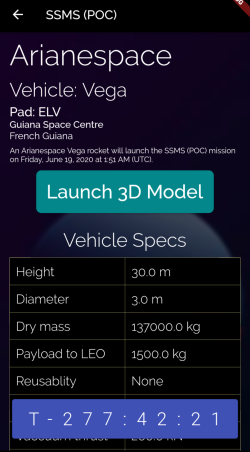

# LiveLaunch

LiveLaunch is an Android app created to allow rocket enthusiasts to get all the data they need about upcoming launches from around the world, including a live countdown, launch vehicle specs, and a 3D AR render of the vehicle being used. Learn more about the project on [Devpost](https://devpost.com/software/livelaunch). The project was created with Flutter, Dart, Unity, EchoAR, and the RocketLive API.

## Our Team:

https://github.com/keyonjerome

https://github.com/manumanuk

https://github.com/kiransuren

https://github.com/andrewzhang35

## Run the Project
Clone this repo to your device. Download git lfs from https://git-lfs.github.com/, and run `git lfs fetch` and `git lfs pull` on the cloned repo. Install Android Studio and set up a test Android device (see steps for [emulator](https://developer.android.com/studio/run/emulator) or a [physical device](https://developer.android.com/studio/run/device)). Once you have your device set up, run the `flutter run` command in your terminal/console to launch LiveLaunch!
